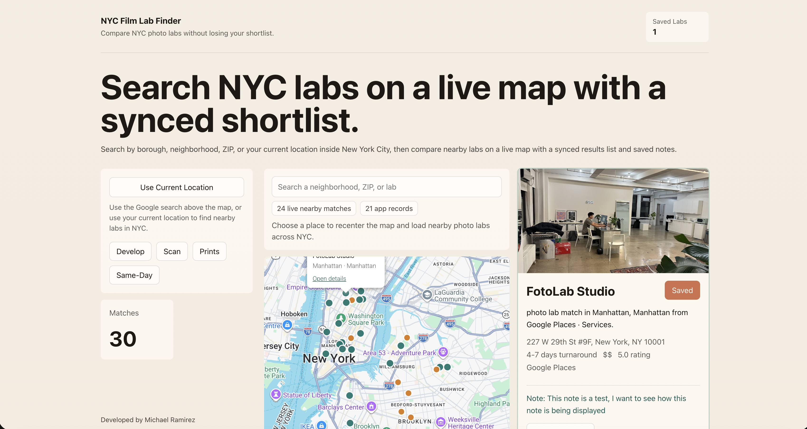
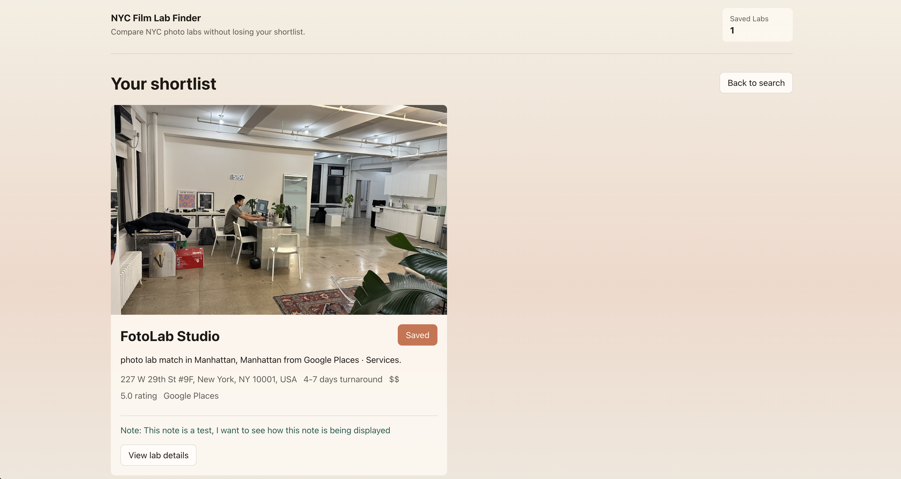

# Photo Lab Finder

Photo Lab Finder is an NYC-only web app for discovering and comparing photography labs by borough, neighborhood, ZIP code, and current location. It uses live Google Places data, supports a Google Maps-driven search experience, and lets users save labs locally with personal notes.

## Live Demo

- Frontend: https://mykeram.github.io/Photo-Lab-Finder/
- API health: https://photo-lab-finder.onrender.com/api/health

## Tech stack

| Layer | Tools |
| --- | --- |
| Frontend | React, Vite, TypeScript |
| Routing | React Router DOM |
| Maps UI | `@react-google-maps/api`, Google Maps JavaScript API |
| Places data | Google Places API (New) |
| Backend | Node.js, Express |
| Database | MongoDB |
| Local state | Browser `localStorage` |
| Dev workflow | `concurrently` |

## Core features

- Search by borough, neighborhood, ZIP, or current location
- Live Google Places autocomplete and map results
- Filter by services such as develop, scan, prints, and same-day turnaround
- Map + list layout with synced results
- Lab detail pages
- Local favorites and saved-lab list
- Personal notes stored in local browser storage
- Google place photos when available
- Responsive mobile-friendly layout

## Architecture

The app is split into a static frontend and a Node API:

1. GitHub Pages serves the Vite build from `src/`
2. The frontend calls the Render API for lab search and place photos
3. The API queries Google Places
4. Results are cached in MongoDB when available

- `src/` contains the React frontend
- `server/` contains the Express API
- The app is NYC-only by design
- There is no seeded fallback dataset in the current flow

## Environment Variables

| Variable | Where to set it | Value |
| --- | --- | --- |
| `GOOGLE_PLACES_API_KEY` | Render | Server-side Google Places API key |
| `MONGODB_URI` | Render | MongoDB Atlas connection string |
| `MONGODB_DB_NAME` | Render | `photo-lab-finder` |
| `PORT` | Render | Usually managed by the host |
| `VITE_API_BASE_URL` | GitHub repo variable for Actions | `https://photo-lab-finder.onrender.com` |
| `VITE_GOOGLE_MAPS_API_KEY` | GitHub repo variable for Actions | Browser Google Maps API key |

Create a `.env` file from `.env.example` for local development. The repo reads the same variable names locally, but the deployment split above keeps the browser-only and server-only keys in the right place.

## Local setup

```bash
npm install
npm run dev
```

The client runs with Vite and opens automatically. The API server runs alongside it on `127.0.0.1:8787` by default.

## Deployment

### API on Render

For deployment, use any Node host that supports environment variables and a long-running process. The server entry point is `server/index.mjs`, and the production start command is:

```bash
npm start
```

Make sure Render sets these environment variables:

- `GOOGLE_PLACES_API_KEY`
- `MONGODB_URI`
- `MONGODB_DB_NAME`

After deployment, the host will show a public service URL. That root URL is what you put into `VITE_API_BASE_URL`.

### Frontend on GitHub Pages

GitHub Pages can host the React frontend, but it cannot run the Express API in `server/`. To deploy the site on Pages:

1. Host the API somewhere else first, or the search and detail views will not load data.
1. Set `VITE_API_BASE_URL` to that hosted API URL in the Pages build environment.
1. Set `VITE_GOOGLE_MAPS_API_KEY` in the build environment if you want the map to load in production.
1. Push to `main`; the included GitHub Actions workflow builds `dist/` and publishes it to Pages.

The app uses hash-based routing so direct links work on GitHub Pages without a custom rewrite rule.

## Available scripts

- `npm run dev`
- `npm run dev:client`
- `npm run dev:server`
- `npm run build`
- `npm run preview`

## API routes

- `GET /api/health`
- `GET /api/labs/search`
- `GET /api/labs/nearby`
- `GET /api/labs/:id`
- `GET /api/google-place-photo`

## Troubleshooting

- `RefererNotAllowedMapError`: the Google Maps browser key needs the GitHub Pages referrer allowed.
- `500` from `/api/labs/search`: check the Render logs and confirm `GOOGLE_PLACES_API_KEY` and `MONGODB_URI`.
- `dbEnabled: false` from `/api/health`: MongoDB is not connected or Atlas access is blocked.
- The first request after Render spins down can be slow on the free tier.

## Notes

- Saved labs and notes are stored locally in the browser.
- The app is focused on NYC only at this stage.
- Google photos are used when a place exposes them; otherwise the UI falls back gracefully.

## Screenshot



## Saved Labs



<small><a href="https://www.flaticon.com/free-icons/camera" title="camera icons">Camera icons created by Freepik - Flaticon</a></small>
